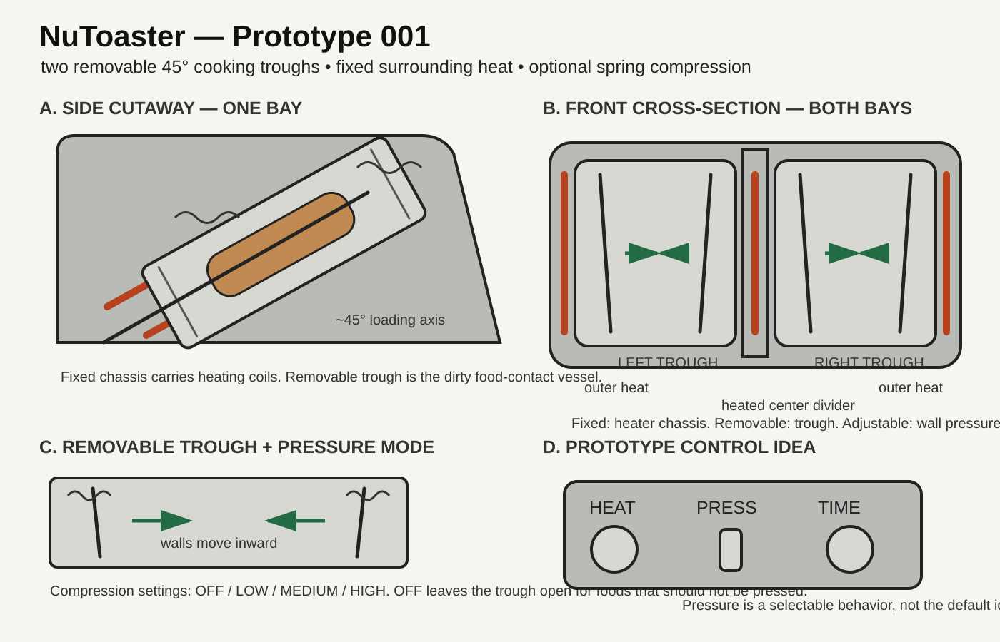

# NuToaster — Prototype 001

Status: **rough prototype sketchdraft / concept slice**

The point of this slice is not to claim a finished appliance. It turns the hand sketch into geometry, mechanisms, operating modes, and a small prototype ladder that can be picked up later without rediscovering the idea.



## One-sentence object

A toaster-shaped dual-bay cooker with two parallel ~45° removable stainless cooking troughs, a fixed coil-heated chassis around and between them, and an **optional adjustable spring-compression mode** that moves the trough walls inward around the food.

## Why this is worth looking at again

The interesting part is not "a toaster that can cook a burger." The combination creates a useful appliance primitive:

**heat + containment + removable food-contact geometry + optional pressure**

A normal toaster gives easy insertion but terrible containment.  
A panini press gives pressure but usually one broad dirty cooking surface.  
An air fryer gives generality but uses a basket/chamber and does not self-fit the food.

NuToaster asks whether a narrow removable vessel can make a toaster-like interaction general-purpose without making cleanup awful.

If that primitive works, different trough geometries could eventually become interchangeable "food cartridges" rather than designing a new appliance for every food.

## Geometry

- Two parallel cooking bays, arranged like the slots of a conventional two-slot toaster.
- Both bays are inclined approximately 45° from horizontal.
- Each bay is open from above for toaster-like loading.
- Each bay receives an independently removable stainless-steel trough.
- A fixed structural/heating divider runs between the two troughs.
- Fixed outer structural/heating walls surround the outside faces.
- Optional cover/lid can retain heat or control splatter without being required for ordinary open-top operation.

### Cross-section shorthand

```text
OUTER HEATED WALL
    |
 [ movable wall ]
 [   TROUGH     ]   <--- removable
 [ movable wall ]
    |
CENTER HEATED / STRUCTURAL DIVIDER
    |
 [ movable wall ]
 [   TROUGH     ]   <--- removable
 [ movable wall ]
    |
OUTER HEATED WALL
```

## Removable trough

The trough is the dirty part on purpose.

Desired properties:

- catches grease, crumbs, cheese, sauce, and cooking residue;
- food-safe stainless construction;
- removable independently from the other trough;
- simple enough to rinse, scrub, soak, or place in a dishwasher;
- receives heat from the fixed chassis around it;
- has moving sidewalls guided by corner rods;
- no inaccessible decorative geometry where food residue can hide.

A flat brush approximately the breadth of the trough is part of the appliance kit so one stroke can clean the floor and lower corners efficiently.

### Cleaning idea

The original concept includes filling an installed trough with water plus a small amount of soap and using low heat to loosen residue before removal.

**Prototype boundary:** treat this as a desired future cleaning mode, not an assumed-safe procedure. A powered water/soap cycle would require deliberate electrical isolation, drainage/overflow handling, maximum-temperature control, and an interlock. The first hot prototype should instead prove that the trough can be removed and washed easily after cooking.

## Heating chassis

Primary heat comes from the appliance body rather than from electrical connections on the removable trough.

Fixed heat structure:

1. left outer heated wall,
2. center heated structural divider,
3. right outer heated wall.

Electric resistance coils are mounted in or against those metal structures, analogous to compact oven/broiler heating architecture.

The removable trough receives conductive and radiant heat from this surrounding chassis.

This is useful because the dirty removable component can remain mechanically simple.

## Compression mechanism

Compression is a **mode**, not a mandatory behavior.

Each trough has movable sidewalls guided on four corner spring rods.

Conceptual settings:

- **OFF** — trough remains open; cook without pressure.
- **LOW** — gentle centering/contact.
- **MEDIUM** — sandwich / vegetable / irregular-solid pressure.
- **HIGH** — deliberate press mode where the food and mechanism safely permit it.

The final force range is deliberately unspecified in Prototype 001. The first mechanical mockup should measure useful travel and force rather than inventing them on paper.

### Why adjustable compression matters

This makes one bay capable of behaving differently depending on the food:

- bread can toast without being crushed;
- a sandwich can receive mild panini-like contact;
- a burger patty can be held securely;
- irregular food can be centered closer to heat;
- liquid or delicate food can use compression OFF.

Compression should fail open/releaseable rather than trap food when power is lost.

## Operating modes worth preserving

The first useful control model is intentionally small:

| Control | Possible values |
|---|---|
| Heat | off / low / medium / high or temperature target |
| Compression | off / low / medium / high |
| Time | manual / timed cycle |
| Bay | left / right independently, or linked |
| Cover | absent / installed |

No "smart appliance" requirement exists. Manual controls are enough to validate the cooking primitive.

## Example use envelope

Plausible targets to test later:

- toast;
- grilled cheese / panini;
- hamburger patty;
- sliced vegetables;
- bacon or sausage-sized items;
- reheating compact leftovers;
- melts;
- other foods that fit safely within a trough.

Eggs, loose liquids, very fatty foods, and anything with substantial expansion/splatter should be treated as test questions rather than assumed capabilities.

## Prototype ladder

### P0 — cardboard / cold geometry

No electricity.

Build one 45° bay full-size from cardboard, wood, sheet plastic, or scrap metal.

Questions:

- Is loading actually comfortable?
- Does food naturally settle at 45°?
- What trough width/depth handles bread and a burger patty?
- Can the trough be lifted out without touching neighboring structure?
- Where should the handle/lip live?

**Success:** useful dimensions and removal motion.

### P1 — cold compression rig

One removable trough plus four guided spring rods and movable walls.

Questions:

- How much wall travel is useful?
- Does four-corner guidance rack or bind?
- Can OFF truly stay open?
- Can pressure be adjusted simply?
- Can the mechanism release easily with greasy parts?

**Success:** pressure system behaves predictably without heat.

### P2 — single hot fixed-wall bay

One trough, one 45° heated bay, no automatic compression required.

Instrument it with temperature sensing.

Questions:

- Does surrounding heat transfer efficiently through the removable trough?
- Are there severe hot/cold zones?
- Can toast/sandwich/patty be cooked without residue escaping the trough?
- How difficult is cleanup after actual fat/cheese?

**Success:** the removable-trough cooking primitive works.

### P3 — hot bay + adjustable compression

Combine P1 and P2.

**Success:** compression improves at least one food class without making another worse or making cleaning intolerable.

### P4 — dual bay

Add the center heated divider and second independent trough.

Questions:

- Does one bay thermally disturb the other?
- Can one bay run while the other is idle?
- Is the center divider structurally and thermally useful?
- Are both troughs independently removable?

### P5 — optional cover + cleaning experiments

Only after the thermal/electrical architecture is controlled.

Investigate:

- splatter cover;
- heat-retention cover;
- safe soak/steam-assisted cleanup;
- overflow containment;
- dishwasher durability.

## Five things that would kill or mutate the design

These are useful tests, not objections to hide.

1. **Trough heat transfer is too slow.**  
   Mutation: increase conductive contact, change gauge/material, or put protected heating surfaces closer to the trough.

2. **The four-corner moving walls bind when dirty.**  
   Mutation: move the mechanism outside the food-contact zone or make the whole pressure insert removable.

3. **Grease reaches heating/electrical structure.**  
   Mutation: deepen trough, add lips/gaskets, establish a cold catch zone, or narrow the food envelope.

4. **45° adds no practical benefit.**  
   Mutation: vary angle experimentally. The angle is a hypothesis, not scripture.

5. **Cleaning is still harder than using a pan.**  
   Mutation: simplify the trough until cleanup becomes the feature again.

## Re-entry triggers

Open this branch again when any of these happen:

- someone has sheet metal / fabrication access;
- the Collective wants a physical appliance prototype;
- a countertop cooking project needs a removable food-contact chamber;
- a cleaning-first appliance mechanism is relevant elsewhere;
- a modular "food cartridge" idea appears;
- someone wants to test whether adjustable pressure materially improves a compact cooker;
- Appliance Prophet King is ready for its first non-digital object.

## Prototype 001 invariants

Keep these unless experiment disproves them:

1. Two parallel toaster-like bays.
2. Approximately 45° loading geometry is the starting hypothesis.
3. Food mess should remain primarily in removable troughs.
4. Troughs are independently removable.
5. Heating infrastructure stays primarily in the fixed chassis.
6. A heated structural divider exists between the troughs.
7. Compression is adjustable and can be **OFF**.
8. Cleanup is a first-class design constraint, not an afterthought.
9. Build evidence outranks the drawing.

## Next smallest physical action

Do **not** start by building a powered appliance.

Make one full-size cold trough in cardboard or cheap sheet material, set it at 45°, put a slice of bread, a sandwich, and a burger-sized object into it, and record:

- mouth width,
- floor width,
- wall height,
- trough length,
- insertion clearance,
- removal clearance,
- useful wall travel.

Those seven numbers are enough to turn Prototype 001 into the first mechanically dimensioned version.
